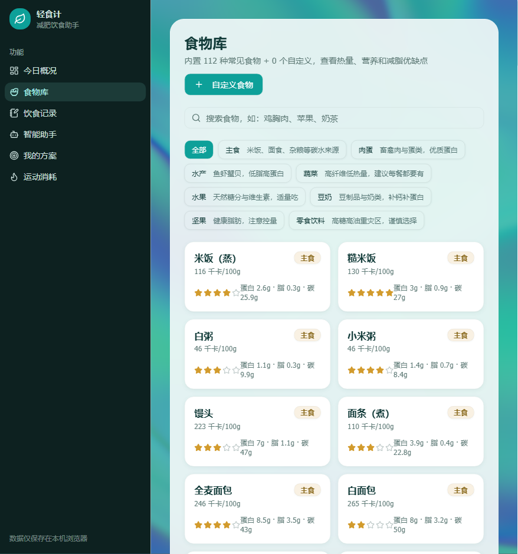
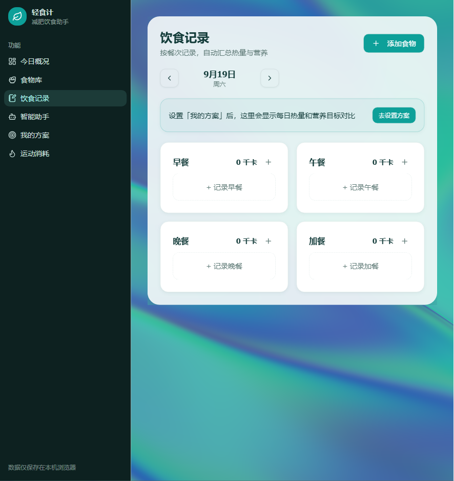

# 轻食计 · 减肥饮食助手

> 一个帮你记录饮食、计算热量与营养、并提供个性化建议的前端 Web 应用。
> 内置 112 种常见食物数据，全部数据保存在浏览器本地，无需注册登录、无需后端即可完整使用。

在线预览：*（部署后补充链接）*

---

## 界面预览

| 今日概况 | 食物库 |
| --- | --- |
|  |  |

| 智能助手 | 饮食记录 |
| --- | --- |
|  |  |

---

## 功能特性

- **今日概况**：热量环形进度、蛋白质/脂肪/碳水/纤维达标情况、按餐次汇总，首页一键快速记录
- **食物库**：112 种内置食物（按主食/肉蛋/水产/蔬菜/水果等分类），支持搜索、自定义添加、常用食物自动排前
- **饮食记录**：按日期、按四餐（早/午/晚/加餐）记录，自动汇总全天热量与营养，支持修改与删除
- **智能助手**：对话式问答，内置规则引擎可直接回答热量查询、食物对比、饮食推荐、运动消耗、减脂知识；可接入大模型（DeepSeek）扩展回答范围，回答中提到的食物可一键添加进记录
- **个性化方案**：填写身高体重/性别/活动水平，自动计算 BMR、TDEE、目标热量与三大营养素
- **形象化反馈**：随身高体重与饮食状态变化的虚拟角色（4 种状态 × 男女两种形象）
- **响应式**：桌面端侧边栏导航，移动端自动切换抽屉菜单与全宽按钮，手机可正常使用

---

## 技术栈

| 分类 | 技术 |
| --- | --- |
| 框架 | React 19 + TypeScript |
| 构建 | Vite |
| 样式 | Tailwind CSS v4 |
| UI 组件 | shadcn/ui + lucide-react 图标 |
| 路由 | react-router-dom（HashRouter） |
| 数据存储 | 浏览器 localStorage |
| 后端（可选） | Express 代理层，用于接入大模型 API |

---

## 项目结构

```
src/
├── pages/            # 六个页面：今日概况/食物库/饮食记录/智能助手/方案/运动
├── components/       # 通用组件（对话框、布局、角色图、背景特效）
├── data/             # 内置食物数据、运动数据、类型定义
├── hooks/            # localStorage 状态管理（档案/记录/角色/自定义食物）
├── lib/              # 营养计算（BMR/TDEE/营养素目标）、问答规则引擎
└── assets/           # 角色形象素材
```

---

## 本地运行

```bash
# 安装依赖
npm install

# 启动开发（前端 + 可选 AI 后端）
npm run dev:all

# 构建生产版本
npm run build
```

> 不启动 AI 后端也能完整使用：智能助手会自动降级为内置规则回答。

---

## 技术亮点

1. **纯前端可用**：核心功能不依赖后端，数据全部存于 localStorage，构建产物可打包成单个 HTML 文件离线使用
2. **营养计算体系**：基于 Mifflin-St Jeor 公式计算 BMR/TDEE，再按减脂目标推算每日热量与三大营养素比例
3. **双模式智能问答**：本地规则引擎保证离线可用与可控回答边界；联网时经后端代理调用大模型扩展能力，且 API Key 不暴露在前端
4. **状态化 UI**：虚拟角色随 BMI 与当日饱腹度动态切换形象与表情，提升产品的反馈感
5. **响应式布局**：一套代码同时适配桌面侧边栏与移动端抽屉导航

---

## 说明

- 本项目为个人学习/作品集项目，食物营养数据为通用参考值，不构成医疗建议
